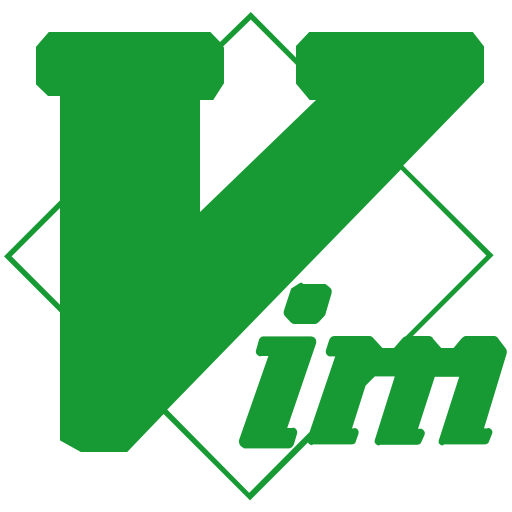

# VimGodot

  
  
<em>Godot Script Editor에서 Vim의 강력함을 경험하세요</em>

## 🚀 소개
VimGodot는 Godot 게임 엔진의 스크립트 편집기에서 Vim의 강력한 기능을 사용할 수 있도록 해주는 플러그인입니다. 이 플러그인을 통해 개발자는 익숙한 Vim 키 바인딩과 명령어를 활용하여 생산성을 높일 수 있습니다.

## 🔥 주요 기능
- **Vim 키 바인딩 지원**: 일반 모드, 삽입 모드, 비주얼 모드 등 Vim의 다양한 모드를 지원합니다.
- **명령어 모드**: Vim의 명령어 모드를 통해 파일 탐색, 편집, 저장 등을 빠르게 수행할 수 있습니다.
- **커스터마이징 가능**: 사용자가 원하는 대로 키 바인딩과 설정을 조정할 수 있습니다.

## 🛠 커스텀 설정
- `res://addons/VimGodot/conf/key_maping.json`: VimGodot의 키 바인딩 설정 파일입니다. 이 파일을 수정하여 원하는 키 바인딩을 설정할 수 있습니다.
- `res://addons/VimGodot/conf/keys_white_list.json`: 특정 키를 화이트리스트에 추가하여 VimGodot가 해당 키 입력을 무시하도록 설정할 수 있습니다.
- 자세한 설정은 [settings.md](docs/settings.md) 파일을 참고하세요.

## 🏗️ 아키텍처

- **[VimCore](src/vim/main.h)**: 세션 관리, 레지스터, 매크로 시스템
- **[EditorAdaptor](src/vim/editor_adaptor.h)**: Godot 에디터 인터페이스 레이어
- **[CommandDispatcher](src/vim/command_dispatcher.h)**: 키 입력을 명령으로 변환
- **[Commands](src/vim/command/)**: 모든 Vim 명령 구현체

### 🎵 특별 감사
- [godot-vim](https://github.com/joshnajera/godot-vim): 이 프로젝트는 godot-vim 프로젝트에서 영감을 받았습니다.

## 📄 라이선스

이 프로젝트는 [MIT License](LICENSE) 하에 배포됩니다.